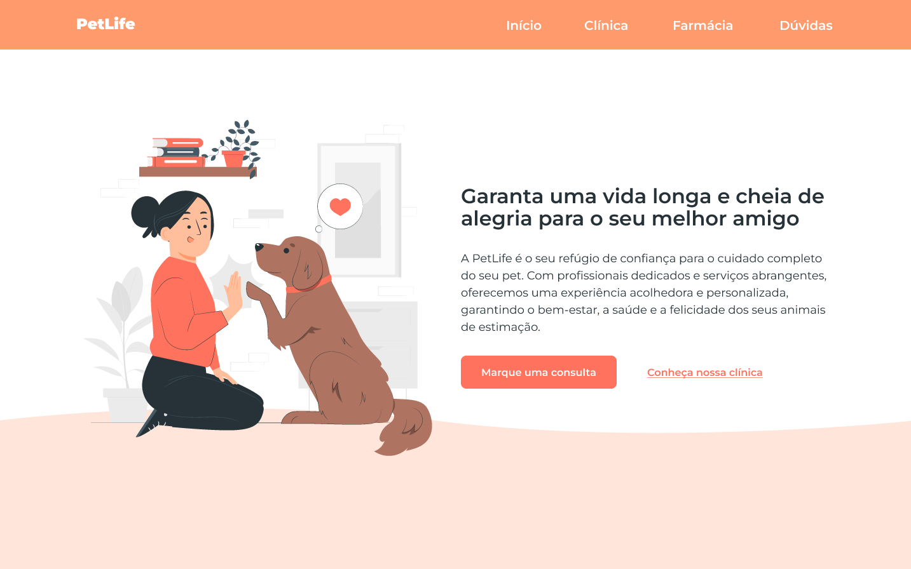

# 🐾 PetLife - Website

[]()
[](https://github.com/jcquadros/petlife/issues)
[](https://github.com/jcquadros/petlife/pulls)
[](LICENSE.md)

Bem-vindo ao repositório do projeto **PetLife**! Este é um site informativo para a clínica veterinária e petshop PetLife, onde você pode conhecer mais sobre nossos serviços de saúde e bem-estar animal, conferir nosso petshop e farmácia, além de obter respostas para dúvidas frequentes.

<p align="center">
  
</p>

---

## 📖 Visão Geral do Projeto

Este projeto foi desenvolvido com **HTML**, **CSS** e **JavaScript**, utilizando um **design responsivo** que se adapta a diferentes tamanhos de tela, proporcionando uma experiência de navegação agradável tanto em desktops quanto em dispositivos móveis.

### ✨ Funcionalidades

- **Cabeçalho com Navegação**: Links rápidos para acessar as seções principais do site.
- **Seção Inicial**: Apresentação do slogan e breve descrição dos serviços.
- **Seção Clínica**: Informações detalhadas sobre os serviços veterinários oferecidos.
- **Seção Farmácia/Petshop**: Detalhes sobre os produtos e medicamentos disponíveis.
- **Dúvidas Frequentes**: Seção expandível para responder a perguntas comuns dos clientes.
- **Rodapé**: Informações de contato e navegação adicional.
- **Design Responsivo**: O site se ajusta automaticamente para diferentes resoluções de tela.

### 🖼️ Demonstração

<p align="center">
  
</p>

---

## 🛠️ Tecnologias Utilizadas

As principais tecnologias utilizadas para construir o site são:

- **HTML**: Estrutura do conteúdo.
- **CSS**: Estilização do site, incluindo variáveis CSS para personalização de cores.
- **JavaScript**: Interatividade para seções expansíveis nas dúvidas frequentes.

## 🚀 Como Usar

Para visualizar o site localmente:

1. Clone o repositório:
   ```bash
   git clone https://github.com/jcquadros/petlife.git
    ```

2. Abra o arquivo index.html em seu navegador para visualizar o site.

## 💻 Design Responsivo
O design foi planejado para proporcionar uma navegação agradável em qualquer dispositivo, seja desktop, tablet ou smartphone.

## 🤝 Contribuindo
Contribuições são bem-vindas! Sinta-se à vontade para abrir uma issue ou enviar um pull request com melhorias e sugestões.

## 📄 Licença
Este projeto está licenciado sob a licença MIT. Consulte o arquivo LICENSE para mais informações.

